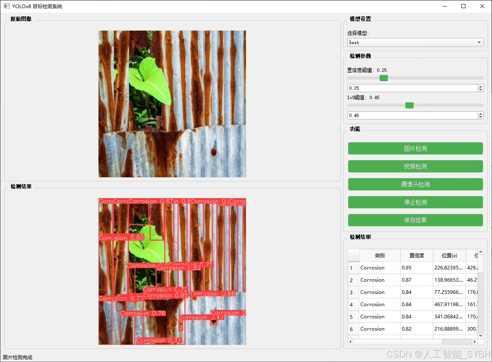
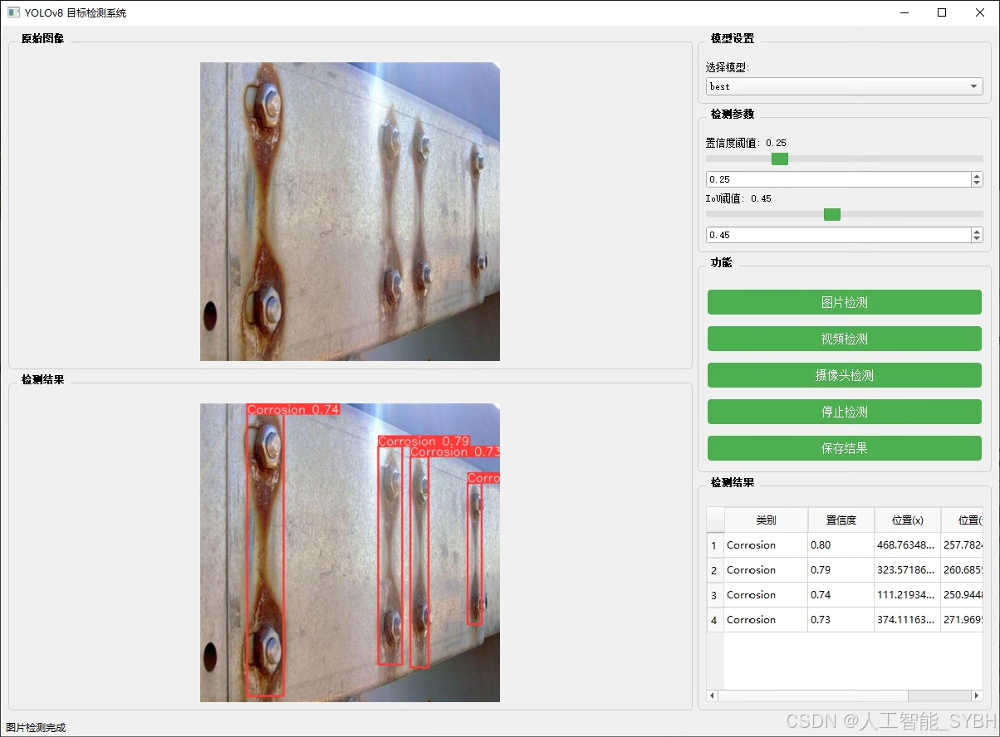
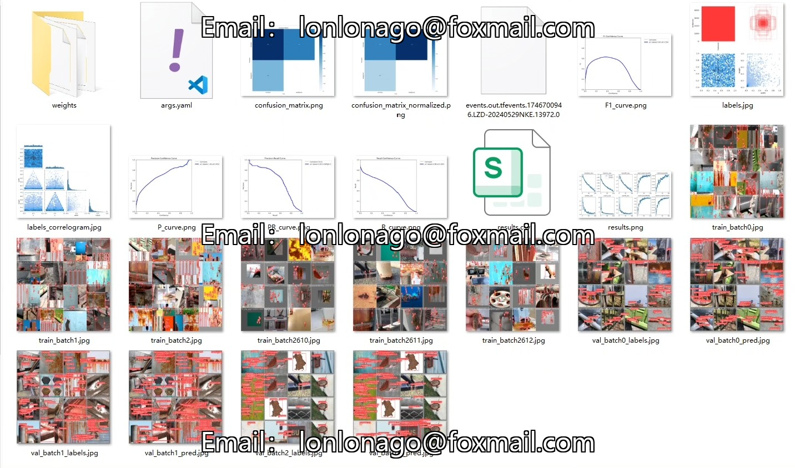
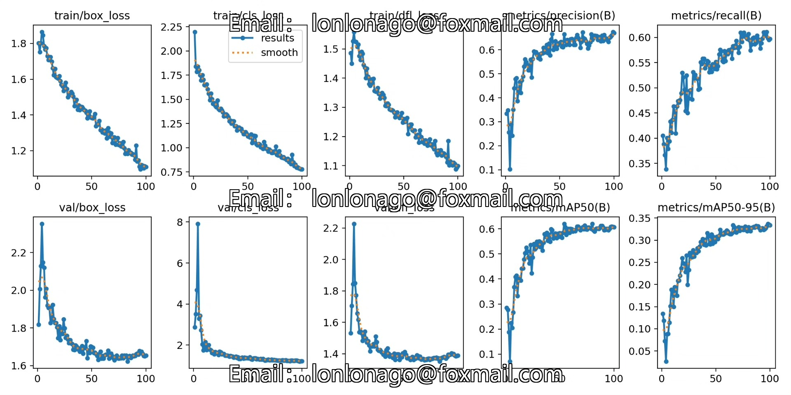
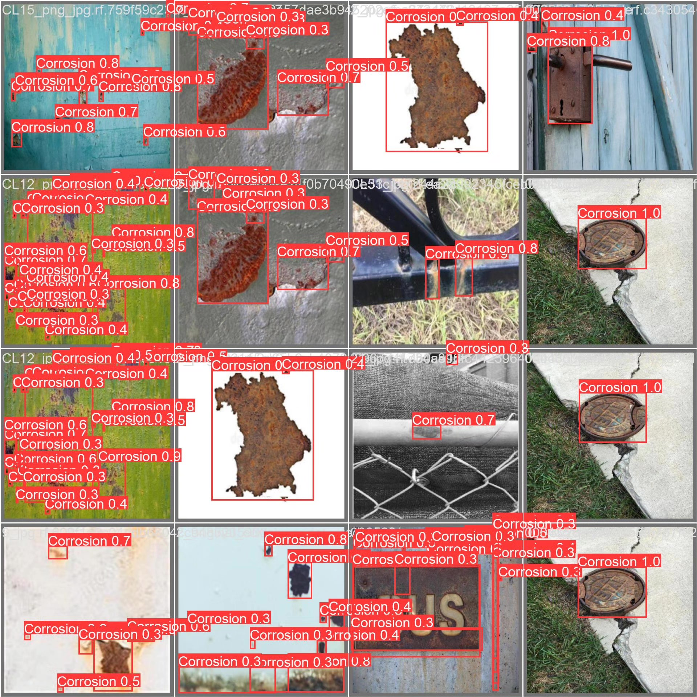
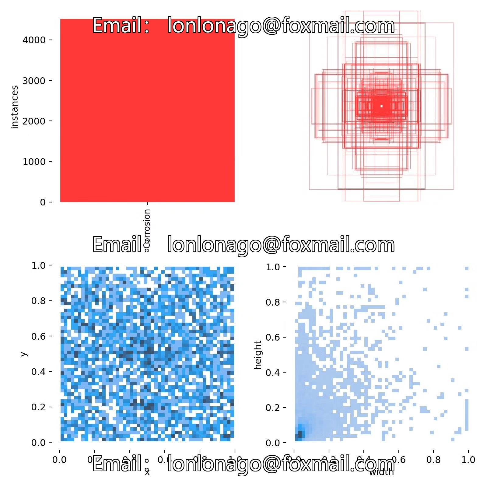
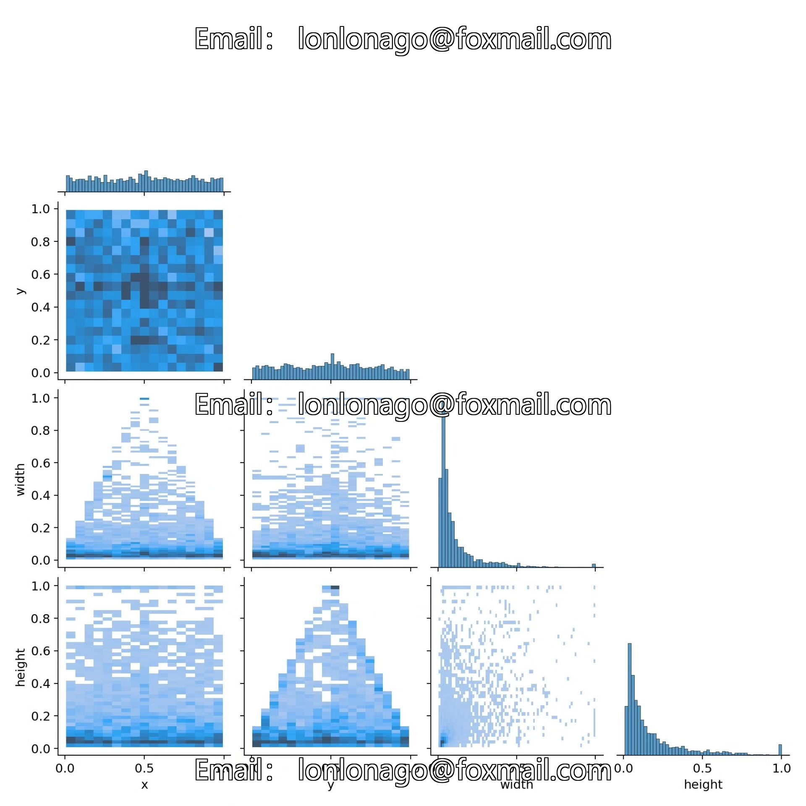
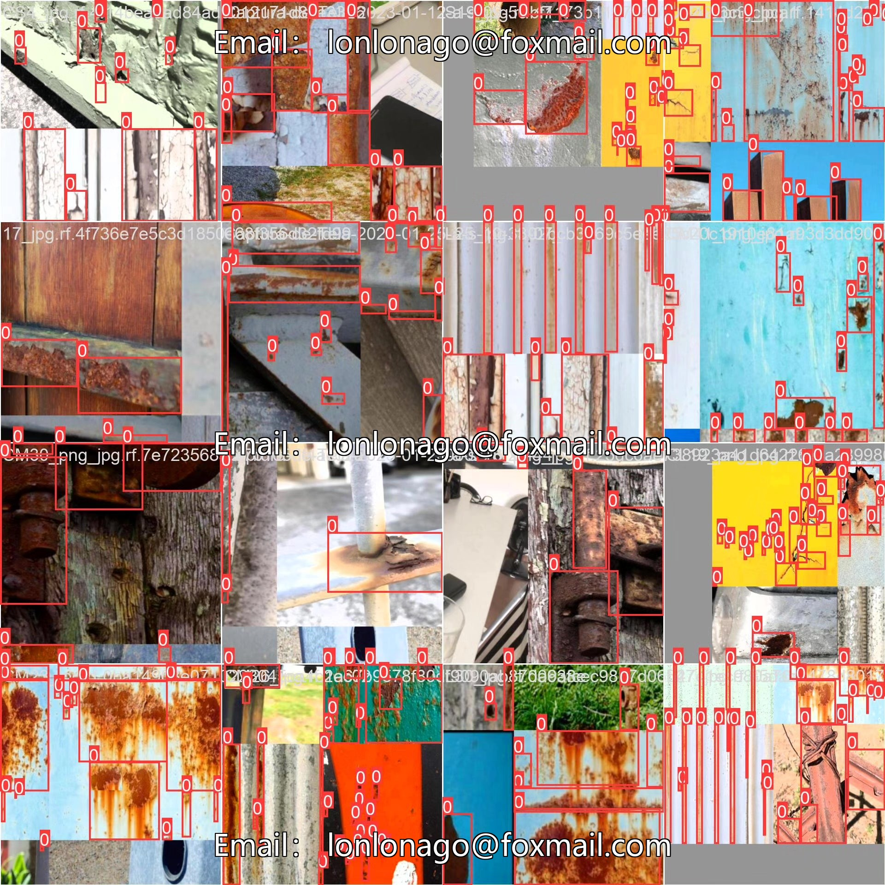

# Steel Corrosion and Rust Detection System Based on YOLOv8 Deep Learning

## Body

This project is based on the advanced YOLOv8 object detection algorithm, developing a set of automatic detection systems specifically for corrosion and rust defects on steel surfaces. The system employs deep learning techniques to accurately identify and locate corrosion areas through real-time analysis of images of steel surfaces. The dataset includes 600 labeled images, with 450 training sets, 120 validation sets, and 30 test sets, all categorized as "Corrosion". This solution not only significantly improves the efficiency and accuracy of steel corrosion detection but also provides reliable data for equipment maintenance decisions through digital means, holding significant application value in the field of industrial equipment health management.

The company's products have obtained YOLO official commercial license certification.

We provide after-sales service.

After payment, we will provide WeChat IDs for instant questions and answers.

Environmental configuration: We will provide an instructional tutorial on environmental configuration, and WeChat will provide答疑.

Remote installation services: If you need remote configuration, an additional fee of 69 is required, with all fees refunded if the configuration fails (only the installation fee is refunded for older computers).

Retraining the dataset: After setting up the environment, you can train on your own computer. If you need us to retrain, just pay 69 plus computing power fees (2.5 yuan/hour).

Full after-sales service

## Images

## Payment

Here is a pay link on Stripe ( https://buy.stripe.com/3cs8yP7sY87d0vu9AB ). Please contact me lonlonago@foxmail.com after funding $89, and I will send you a complete data files , thank you!

